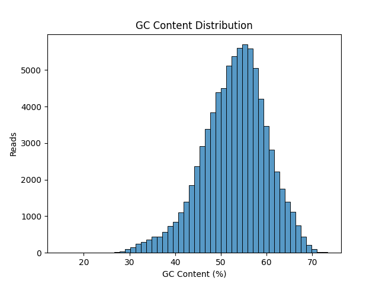
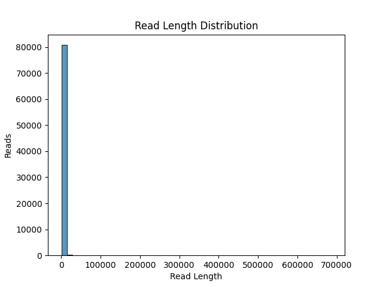
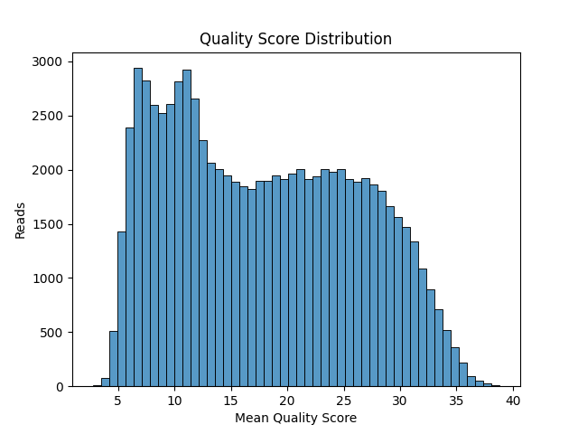
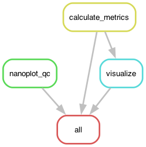

# Long-Read Sequencing QC Pipeline

## Overview

This project implements a reproducible **bioinformatics pipeline** for performing **quality control (QC) on long-read sequencing data**.

The pipeline processes raw FASTQ files and generates:

* Quality control analysis using **NanoPlot**
* Per-read statistics
* Visualization of key sequencing metrics
* Summary statistics for interpretation

The workflow is implemented using **Snakemake** and runs inside a **Conda environment**, ensuring full reproducibility.

---

## Input

Raw sequencing data in **FASTQ format**.

Example used in this project:

```
barcode77.fastq.gz
```

---

## Pipeline Steps

### 1. Quality Control

The pipeline uses **NanoPlot**, a tool specifically designed for long-read sequencing technologies such as Oxford Nanopore.

NanoPlot generates:

* Read length distributions
* Quality score distributions
* Read length vs quality plots
* Yield statistics

Output:

```
results/nanoplot/NanoPlot-report.html
```

---

### 2. Custom Read Metrics

A Python script calculates the following metrics for **each read**:

* GC Content (%)
* Read Length
* Mean Read Quality Score

Output:

```
results/read_metrics.csv
```

Example:

```
read_id,read_length,gc_content,mean_quality
read_1,206,54.8,20.6
```

---

### 3. Data Visualization

Using the computed metrics, the pipeline generates distribution plots for:

- GC Content
- Read Length
- Mean Read Quality

#### GC Content Distribution



        _The GC content distribution shows a roughly bell-shaped curve centered around ~53% GC. Most reads fall between approximately 48% and 58% GC, indicating relatively      consistent nucleotide composition across the dataset. Such a distribution is expected when sequencing reads originate from a single organism or a homogeneous biological          sample. The absence of multiple peaks or strong skewness suggests there is likely no major contamination or GC bias introduced during sequencing._

#### Read Length Distribution



        _The read length distribution is strongly right-skewed, with the majority of reads between ~100 and ~1000 bp. A small number of extremely long reads (up to ~686 kb) extend the tail of the distribution. This pattern is typical for long-read sequencing technologies such as Oxford Nanopore, where a small fraction of ultra-long reads significantly increases the maximum read length. Because the distribution is highly skewed, NanoPlot also generates log-transformed read length histograms to better visualize the majority of reads._

#### Quality Score Distribution



        _The quality score distribution shows that most reads fall between approximately Q10 and Q30, with an average quality score of ~17.9. This range is typical for Oxford Nanopore long-read sequencing technologies, where quality scores are generally lower than those produced by short-read platforms such as Illumina. Despite this, the observed quality levels are generally sufficient for downstream analyses such as read alignment or assembly, especially when combined with the long read lengths produced by Nanopore sequencing._


---

## Workflow

Pipeline DAG:




---

## Summary Statistics (Example Dataset)

| Metric             | Value    |
| ------------------ | -------- |
| Number of Reads    | 81,011   |
| Mean Read Length   | 1,038 bp |
| Median Read Length | 547 bp   |
| N50                | 1,761 bp |
| Mean GC Content    | 53%      |
| Mean Quality Score | 17.9     |

---

## Interpretation

The dataset shows characteristics typical of **Oxford Nanopore long-read sequencing**:

* GC content distribution is approximately normal.
* Read length distribution shows a long tail with very long reads.
* Quality scores are within the expected range for Nanopore sequencing.

No major quality issues were detected.

---

## Recommendation

The sequencing data appears suitable for downstream analysis.

Recommended next step:

```
Genome alignment (e.g., minimap2)
```

Example command:

```
minimap2 -ax map-ont reference.fasta reads.fastq > alignment.sam
```

---

## Installation

Clone the repository:

```
git clone https://github.com/happymealinthebuilding/longread_qc_pipeline.git
cd longread_qc_pipeline
```

Create environment and run pipeline:

```
snakemake --snakefile workflow/Snakefile --use-conda --cores 2
```

---

## Requirements

* Python
* Snakemake
* Conda
* NanoPlot
* pandas
* matplotlib
* seaborn

All dependencies are defined in:

```
envs/qc_env.yml
```

---

## Author

Azra Tuncay
